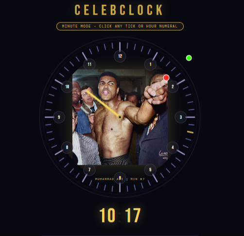

# Celebrity Minute-Hand Clock — Project Plan

## Screenshot

## Concept
An analog clock where instead of a minute hand, a celebrity image is displayed in the center, pointing outward toward the current minute. The celebrity's face and body naturally face the direction they're pointing. The pointed-at tick mark or hour numeral enlarges while active.

---

## Key Insight: AI Is Always Needed
Even the best natural photo will rarely point at the *exact* minute angle. The goal of image hunting is to **minimize the AI correction delta** — a photo naturally pointing near the target minute needs only a tiny nudge and looks far more convincing than a large correction. Aim for a source image within ~15° (≈2–3 minutes) of the target.

---

## Clock Features
- **Hour numerals** shown in small circles around the face
- **Minute ticks** for all 60 minutes
- **Hour hand** on top (set by: click hour hand → click numeral → returns to minute-setting mode)
- **Minute interaction**: clicking a tick or hour numeral sets that minute
- **Digital clock** below showing HH:MM
- **Celebrity image** in center, behind the clock face, pointing at the current minute
- **Active tick/numeral** enlarges when pointed at, returns to normal when minute changes

---

## Image Strategy Options

### Option 1 — Real photos already pointing near the right direction
- Human searches "[celeb] pointing", skims images, notes clock angle, records URL
- Assign each photo to its nearest minute
- AI makes small angle corrections only
- **Best quality, least AI distortion**

### Option 2 — Real pointing photos, AI fixes angle on-the-fly at runtime
- Collect source images pointing in any direction
- AI image-editing API adjusts arm/finger to exact angle each minute
- Dynamic — celeb can be random, not pre-assigned to a minute
- **Con**: latency per minute; larger corrections = less natural

### Option 3 — Same as Option 2 but pre-processed (60 static images)
- Run AI editing in advance for all 60 minutes
- Fast at runtime, no API calls during use

### Option 4 — Any photo with visible arm/hand; AI transforms into a point
### Option 5 — Any celeb photo; AI invents/inserts pointing arm entirely

---

## Minute Map
*(Ordered by minute 0–59. Fill in one chosen celeb + URL per minute. Mark AI delta needed.)*

| Min | Clock pos | Chosen celeb | Natural photo URL | AI delta needed | Status |
|-----|-----------|--------------|-------------------|-----------------|--------|
| 0  | 12:00 | Elvis / Obama / Michelle / Trump | | small | ✅ candidates |
| 1  | 12:06 | Muhammad Ali | | TBD | ✅ confirmed |
| 2  | 12:12 | Elvis Presley (iconic) | | small | ✅ confirmed |
| 3  | 12:18 | Elvis / Obama / Michelle / Trump | | small | ✅ candidates |
| 4  | 12:24 | Donald Trump | | TBD | ✅ confirmed |
| 5  | 12:30 | | | | ⬜ needed |
| 6  | 1:00 | Elvis / Obama | | TBD | ✅ candidates |
| 7  | 1:06 | Muhammad Ali | | small | ✅ confirmed |
| 8  | 1:12 | | | | ⬜ needed |
| 9  | 1:18 | | | | ⬜ needed |
| 10 | 1:24 | | | | ⬜ needed |
| 11 | 1:30 | | | | ⬜ needed |
| 12 | 1:36 | | | | ⬜ needed |
| 13 | 1:42 | | | | ⬜ needed |
| 14 | 1:48 | | | | ⬜ needed |
| 15 | 3:00 | Muhammad Ali | embedded (Lorenzo Folli colorized) | ~0° | ✅ near-perfect |
| 16 | 2:00 | | | | ⬜ needed |
| 17 | 2:06 | | | | ⬜ needed |
| 18 | 2:12 | | | | ⬜ needed |
| 19 | 2:18 | | | | ⬜ needed |
| 20 | 2:24 | | | | ⬜ needed |
| 21 | 2:30 | | | | ⬜ needed |
| 22 | 2:36 | | | | ⬜ needed |
| 23 | 2:42 | | | | ⬜ needed |
| 24 | 2:48 | | | | ⬜ needed |
| 25 | 2:54 | | | | ⬜ needed |
| 26 | 3:00 | Uncle Sam poster | | ~0° (natural 3 o'clock!) | ✅ near-perfect |
| 27 | 3:06 | | | | ⬜ needed |
| 28 | 3:12 | | | | ⬜ needed |
| 29 | 3:18 | | | | ⬜ needed |
| 30 | 3:24 | | | | ⬜ needed |
| 31 | 3:30 | | | | ⬜ needed |
| 32 | 3:36 | | | | ⬜ needed |
| 33 | 3:42 | | | | ⬜ needed |
| 34 | 3:48 | | | | ⬜ needed |
| 35 | 3:54 | Hillary Clinton | | TBD | ✅ confirmed |
| 36 | 4:00 | | | | ⬜ needed |
| 37 | 4:06 | | | | ⬜ needed |
| 38 | 4:12 | | | | ⬜ needed |
| 39 | 4:18 | | | | ⬜ needed |
| 40 | 4:24 | | | | ⬜ needed |
| 41 | 4:30 | | | | ⬜ needed |
| 42 | 4:36 | | | | ⬜ needed |
| 43 | 4:42 | | | | ⬜ needed |
| 44 | 4:48 | | | | ⬜ needed |
| 45 | 4:54 | | | | ⬜ needed |
| 46 | 5:00 | | | | ⬜ needed |
| 47 | 5:06 | | | | ⬜ needed |
| 48 | 5:12 | | | | ⬜ needed |
| 49 | 5:18 | | | | ⬜ needed |
| 50 | 5:24 | | | | ⬜ needed |
| 51 | 5:30 | | | | ⬜ needed |
| 52 | 5:36 | | | | ⬜ needed |
| 53 | 5:42 | | | | ⬜ needed |
| 54 | 5:48 | | | | ⬜ needed |
| 55 | 5:54 | Elvis Presley | | TBD | ✅ confirmed (≈6 o'clock) |
| 56 | 6:06 | | | | ⬜ needed |
| 57 | 6:12 | | | | ⬜ needed |
| 58 | 6:18 | | | | ⬜ needed |
| 59 | 6:24 | | | | ⬜ needed |

> **Note on minute↔clock position mapping:**
> Min 0=12:00, Min 5=1:00, Min 10=2:00, Min 15=3:00, Min 20=4:00,
> Min 25=5:00, Min 30=6:00, Min 35=7:00, Min 40=8:00, Min 45=9:00,
> Min 50=10:00, Min 55=11:00

---

## Known Candidates (to be assigned to best-matching minute)

| Celebrity | Known pointing directions | Best minute targets |
|-----------|--------------------------|---------------------|
| Muhammad Ali | ~1 o'clock | 6, 7 |
| Elvis Presley | 2, 3, 6, 7, 9, 10, 11, 12 o'clock | 10,15,30,35,45,50,55,0 |
| Barack Obama | 9, 10, 11, 12, 3, 6 o'clock | 45,50,55,0,15,30 |
| Michelle Obama | 12, 1, 2, 3, 9 o'clock (thumb up) | 0,6,10,15,45 |
| Donald Trump | 9, 10, 11, 12, 1, 2, 3, 4 o'clock | 45,50,55,0,6,10,15,20 |
| Hillary Clinton | ~7 o'clock | 35 |
| Uncle Sam (poster) | ~3 o'clock (straight out) | 15 (natural), 14–16 (tiny delta) |
| ET | glowing finger — assignable | TBD |
| Mozart (Amadeus) | TBD — search needed | TBD |

---

## Celebrity Pool (63 total — trim to 60 after sourcing)

| # | Name | Category | Pointing photo found? | URL |
|---|------|----------|-----------------------|-----|
| 1 | Muhammad Ali | Athlete | ✅ yes | |
| 2 | Elvis Presley | Musician | ✅ yes (multiple) | |
| 3 | Barack Obama | Politician | ✅ yes (multiple) | |
| 4 | Michelle Obama | Politician | ✅ yes | |
| 5 | Donald Trump | Politician | ✅ yes (multiple) | |
| 6 | Hillary Clinton | Politician | ✅ yes | |
| 7 | Uncle Sam | Illustrated icon | ✅ poster | |
| 8 | ET | Non-human/film | ✅ iconic scene | |
| 9 | Mozart (Amadeus film) | Film character | ⬜ search needed | |
| 10 | Audrey Hepburn | Actor | ⬜ search needed | |
| 11 | Morgan Freeman | Actor | ⬜ search needed | |
| 12 | Meryl Streep | Actor | ⬜ search needed | |
| 13 | Bruce Lee | Actor/Athlete | ⬜ search needed | |
| 14 | Sophia Loren | Actor | ⬜ search needed | |
| 15 | Denzel Washington | Actor | ⬜ search needed | |
| 16 | Marilyn Monroe | Actor | ⬜ search needed | |
| 17 | Jackie Chan | Actor | ⬜ search needed | |
| 18 | Cate Blanchett | Actor | ⬜ search needed | |
| 19 | Anthony Hopkins | Actor | ⬜ search needed | |
| 20 | Beyoncé | Musician | ⬜ search needed | |
| 21 | David Bowie | Musician | ⬜ search needed | |
| 22 | Aretha Franklin | Musician | ⬜ search needed | |
| 23 | Mick Jagger | Musician | ⬜ search needed | |
| 24 | Shakira | Musician | ⬜ search needed | |
| 25 | Frank Sinatra | Musician | ⬜ search needed | |
| 26 | Rihanna | Musician | ⬜ search needed | |
| 27 | Louis Armstrong | Musician | ⬜ search needed | |
| 28 | BTS Jimin | Musician | ⬜ search needed | |
| 29 | Serena Williams | Athlete | ⬜ search needed | |
| 30 | Pelé | Athlete | ⬜ search needed | |
| 31 | Usain Bolt | Athlete | ⬜ search needed | |
| 32 | Billie Jean King | Athlete | ⬜ search needed | |
| 33 | Michael Jordan | Athlete | ⬜ search needed | |
| 34 | Nadia Comaneci | Athlete | ⬜ search needed | |
| 35 | LeBron James | Athlete | ⬜ search needed | |
| 36 | Simone Biles | Athlete | ⬜ search needed | |
| 37 | Cristiano Ronaldo | Athlete | ⬜ search needed | |
| 38 | Winston Churchill | Politician | ⬜ search needed | |
| 39 | Malala Yousafzai | Activist | ⬜ search needed | |
| 40 | Nelson Mandela | Politician | ⬜ search needed | |
| 41 | Angela Merkel | Politician | ⬜ search needed | |
| 42 | JFK | Politician | ⬜ search needed | |
| 43 | Moshe Dayan | Politician/Military | ⬜ search needed | |
| 44 | Albert Einstein | Scientist | ⬜ search needed | |
| 45 | Stephen Hawking | Scientist | ⬜ search needed | |
| 46 | Marie Curie | Scientist | ⬜ search needed | |
| 47 | Neil deGrasse Tyson | Scientist | ⬜ search needed | |
| 48 | Charlie Chaplin | Comedian | ⬜ search needed | |
| 49 | Robin Williams | Comedian | ⬜ search needed | |
| 50 | Lucille Ball | Comedian | ⬜ search needed | |
| 51 | Eddie Murphy | Comedian | ⬜ search needed | |
| 52 | Ellen DeGeneres | Comedian | ⬜ search needed | |
| 53 | Oprah Winfrey | TV/Media | ⬜ search needed | |
| 54 | Mr. T | TV/Media | ⬜ search needed | |
| 55 | Hugh Jackman | Actor | ⬜ search needed | |
| 56 | Whoopi Goldberg | Actor | ⬜ search needed | |
| 57 | James Dean | Actor | ⬜ search needed | |
| 58 | Alfred Hitchcock | Director | ⬜ search needed | |
| 59 | Frida Kahlo | Artist | ⬜ search needed | |
| 60 | Andy Warhol | Artist | ⬜ search needed | |
| 61 | Spike Lee | Director | ⬜ search needed | |
| 62 | Princess Diana | Royalty | ⬜ search needed | |
| 63 | Elon Musk | Tech/Business | ⬜ search needed | |

---

## Human Workflow (image hunting)
1. Google **"[celebrity name] pointing"**
2. Skim image results — note the clock angle of each promising photo
3. Right-click → Copy image address → paste URL into the table above
4. Assign the celeb to the minute closest to their natural pointing angle
5. Note the AI delta (how many degrees of correction needed)
6. Repeat until all 60 minutes are covered

## Next Steps
- [ ] Human fills in URL column for known candidates (Ali, Elvis, Obama, Trump, Clinton, Michelle)
- [ ] Continue searching remaining 50+ celebs
- [ ] Identify which minutes still have no candidate at all
- [ ] For those: decide Option 2/3/4/5 per minute
- [ ] Build AI image-adjustment pipeline (done — see `celebrity-clock.html`)
- [ ] Pre-process all 60 images or wire up runtime AI call

---

## CelebClock App — Interaction Spec (v2)

### App Name
**CelebClock** (not "Celebrity Clock")

### Default Mode: Minute Setting
- On load, app is in **Minute Mode**
- Banner reads: `● Minute Mode — click any tick or hour numeral`

### Clicking ticks or hour circles (Minute Mode)
- Any tick (minute or hour-position) is **large and clickable** (20px invisible hit zone)
- Any hour circle (ring, interior, or numeral) is clickable
- Effect:
  1. Sets `curMinute` to that minute
  2. Updates digital clock display (MM)
  3. Active tick/numeral enlarges and highlights gold
  4. Fires `onMinuteChanged(m)` → triggers celeb image update event

### Hour hand interaction → Hour Mode
- Clicking the **hour hand** enters **Hour Mode**
- Hour hand turns **orange** (glows)
- Banner changes to: `● Hour Mode — click an hour numeral to set hour`
- Digital clock turns orange
- Clicking any hour circle sets the hour:
  1. `curHour` = clicked hour
  2. Digital HH updates
  3. Hour hand moves to new position
  4. App **immediately returns to Minute Mode**

### Celeb image
- Displayed centered, behind the SVG clock face (z-index below SVG)
- Circular crop, 320×320px
- When minute changes → `onMinuteChanged(m)` fires (hook for static swap or AI call)
- Label shows celebrity name + current minute

### AI Panel
- Load by URL or file upload
- Celebrity name field
- Optional minute override (0–59)
- **AI Adjust** button: sends image + target minute to Claude API
  - Returns: current angle analysis, delta needed, editing instructions, image-gen prompt
  - Also sets the clock to that minute

### Muhammad Ali — default demo image
- Source: Wikimedia Commons (freely accessible)
- Pointing angle: ~1 o'clock slightly past → assigned to **minute 7**
- Note: The Reddit colorized Laffont photo (arm horizontal ~3 o'clock → min 15)
  cannot be hotlinked; use downloaded/uploaded version for that specific photo